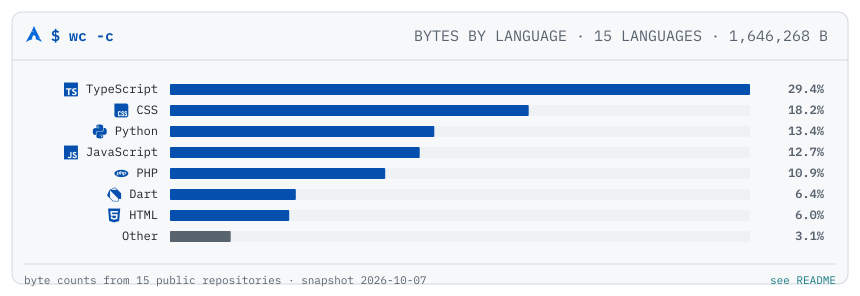
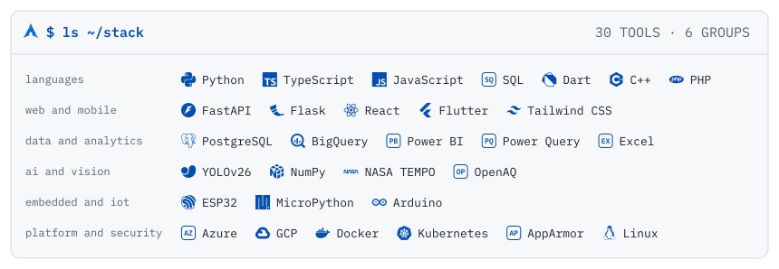

<!--
  README.md is generated. Edit data/profile.json or templates/README.md.tmpl
  and run `python scripts/build.py`; this file is overwritten on every build.
-->
<picture>
  <source media="(prefers-color-scheme: dark)" srcset="assets/banner-dark.svg">
  
</picture>

Systems engineering student at **Universidad Nacional del Callao** (UNAC), Callao, Peru · 2024 - 2028.

I build data pipelines and real-time monitoring systems, and I harden the infrastructure they run on.

**Currently:** Real-time video analytics for the Port of Callao (VigiaCallao).

   

---

## Featured work

### [Chica del Clima](https://github.com/LimitCodev/2025_NASA_Space_Apps_Challenge)
**NASA Space Apps Challenge 2025** · Backend, team of 4

Air-quality dashboard that turns three official data sources into a risk score for people who are exposed to pollution.

- 3 APIs ingested and normalised (NASA TEMPO, OpenAQ, Open-Meteo)
- Tropospheric NO2, PM2.5 and AQI with 24 h forecasts
- Vulnerability scoring for at-risk groups by zone

`FastAPI` `JavaScript` `HTML` `CSS`

**Outcome:** Galactic Problem Solver certificate, NASA Space Apps Challenge (Oct 2025)

<a href="https://drive.google.com/file/d/1L6f8nJNxbonqMQjJrEAU1bTJpitkozWK/view?usp=sharing"><picture><source media="(prefers-color-scheme: dark)" srcset="assets/verified-dark.svg"></picture></a>

### [VigiaCallao](https://github.com/LimitCodev/VigiaCallao)
**Finalist, Reto Callao Tech 2026 · Congress of the Republic of Peru** · Machine learning, team of 3

Control centre that watches the Port of Callao with real-time video analytics and pushes alerts to an operator console.

- YOLOv26 object detection with per-zone monitoring
- Flask + Socket.IO event stream to the operator console
- Flutter control centre over a REST + WebSocket backend

`Python` `Dart` `YOLOv26` `Flask`

**Outcome:** Certificate of recognition from the Science, Innovation and Technology Committee (CCIT), Congress of the Republic of Peru (Jul 2026)

<a href="https://drive.google.com/file/d/1hcyT9XxvSF03BhdMRCb-vInzagWpYaax/view?usp=sharing"><picture><source media="(prefers-color-scheme: dark)" srcset="assets/verified-dark.svg"></picture></a>

**Other credentials:** Participant, Torneo Peruano de Programacion — UPC (Jul 2025) · PMBOK 8th edition, foundational training — CIP (2026) · Data Analytics specialisation — Netzun (2025)

---

## Languages and tools

<picture>
  <source media="(prefers-color-scheme: dark)" srcset="assets/chart-dark.svg">
  
</picture>

<picture><source media="(prefers-color-scheme: dark)" srcset="assets/stack-dark.svg"></picture>

---

## Connect

[LinkedIn](https://www.linkedin.com/in/ynocencio-alex-342862332/) · [Portfolio](https://limitcodev.github.io/) · [YouTube](https://www.youtube.com/channel/UCVMM8TPjyRt4kkX1gCaPWoQ) · [HackerRank](https://www.hackerrank.com/profile/callirgos_josue1)

---

Generated by <code>scripts/build.py</code> from <code>data/profile.json</code> · banner 99.6 KB + chart 27.7 KB + stack 55.6 KB + verified 3.3 KB = 186.3 KB · 8 image requests · outlined text, no web fonts, no JavaScript · surfaces are GitHub Primer tokens so the panels have no edge to fade into · data from 2026-10-07, refreshed daily by GitHub Actions
